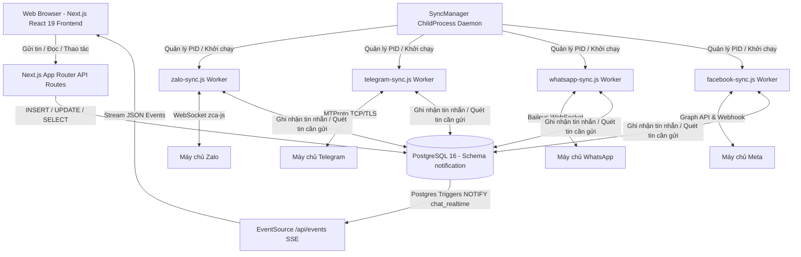
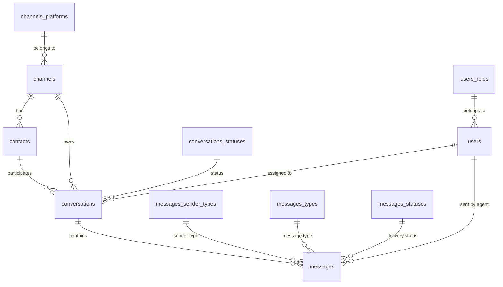
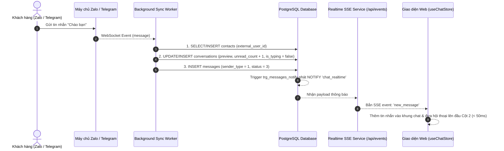
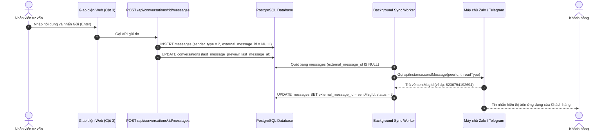

# TÀI LIỆU KIẾN TRÚC & ĐẶC TẢ HỆ THỐNG TERAX OMNICHANNEL CENTRAL INBOX
*(app_notification.md)*

---

## MỤC LỤC
1. [Giới thiệu Tổng quan & Mục tiêu Dự án](#1-giới-thiệu-tổng-quan--mục-tiêu-dự-án)
2. [Kiến trúc Công nghệ (Tech Stack & System Architecture)](#2-kiến-trúc-công-nghệ-tech-stack--system-architecture)
3. [Cấu trúc Thư mục & Bố trí API Routes](#3-cấu-trúc-thư-mục--bố-trí-api-routes)
4. [Bản đồ Cơ sở Dữ liệu & Chi tiết từng Bảng / Cột (Database Schema Mapping)](#4-bản-đồ-cơ-sở-dữ-liệu--chi-tiết-từng-bảng--cột-database-schema-mapping)
5. [Đặc tả Chi tiết Toàn bộ API Hệ thống (API Reference)](#5-đặc-tả-chi-tiết-toàn-bộ-api-hệ-thống-api-reference)
6. [Chi tiết các Luồng Hoạt động (Core System Workflows)](#6-chi-tiết-các-luồng-hoạt-động-core-system-workflows)
7. [Tiến trình Chạy ngầm Đồng bộ (Background Sync Workers)](#7-tiến-trình-chạy-ngầm-đồng-bộ-background-sync-workers)
8. [Cơ chế Real-time SSE & PostgreSQL LISTEN / NOTIFY](#8-cơ-chế-real-time-sse--postgresql-listen--notify)

---

## 1. GIỚI THIỆU TỔNG QUAN & MỤC TIÊU DỰ ÁN

### 1.1. Bối cảnh & Mục tiêu
Ứng dụng **Terax Omnichannel Central Inbox** (`Main_notification`) là nền tảng quản trị hộp thư hội thoại đa kênh tập trung, phục vụ chăm sóc khách hàng, tư vấn bán hàng và vận hành doanh nghiệp.

Thay vì nhân viên tư vấn phải mở cùng lúc nhiều ứng dụng (Zalo, Telegram, Facebook Messenger, WhatsApp), hệ thống tích hợp toàn bộ các kênh này vào **một giao diện Web duy nhất (Giao diện 3 cột chuẩn quốc tế)**:
- **Cột 1 (Sidebar Kênh & Bộ lọc)**: Danh sách tài khoản các nền tảng (Zalo, Telegram, Facebook, WhatsApp), trạng thái kết nối, nút thêm kênh, bộ lọc tin nhắn (Tất cả, Chưa đọc, Đang chờ, Đã xong).
- **Cột 2 (Danh sách Hội thoại)**: Danh sách khách hàng và nhóm chat xếp theo thời gian mới nhất, số tin chưa đọc (Unread Badge), preview tin nhắn cuối cùng, chỉ báo đang soạn tin (`Đang soạn tin...`).
- **Cột 3 (Khung Chat Chi tiết)**: Toàn bộ lịch sử tin nhắn, thông tin người gửi/thành viên nhóm, khung soạn thảo tin nhắn đa phương tiện (văn bản, ảnh, video, tài liệu), công cụ tạo bình chọn (Poll) cho nhóm Zalo, và các hành động chuyển trạng thái hội thoại.

### 1.2. Điểm đặc biệt của Hệ thống
1. **Kết nối Tài khoản Cá nhân (Personal Accounts Interop)**:
   - Hỗ trợ Zalo cá nhân qua mã QR (`zca-js`).
   - Hỗ trợ Telegram cá nhân qua số điện thoại/OTP/2FA bằng giao thức MTProto (`telegram/sessions`).
   - Hỗ trợ WhatsApp cá nhân qua QR code hoặc Pairing Code 8 số (`@whiskeysockets/baileys`).
   - Hỗ trợ Facebook Page qua Meta Graph API & Webhook.
2. **Hỗ trợ đồng bộ 2 chiều (Two-way Realtime Sync)**:
   - Khách nhắn từ điện thoại -> Web nhận ngay lập tức (< 50ms) không cần tải lại trang.
   - Nhân viên trả lời trên Web -> Tự động chuyển tiếp đến ứng dụng Zalo/Telegram/Facebook của khách.
3. **Phân biệt rạch ròi Hội thoại Cá nhân (1-1) và Hội thoại Nhóm (Group)**:
   - Nhóm Zalo tự động nhận diện thành viên gửi tin và hiển thị tên người gửi trong nhóm.
   - Hỗ trợ tạo bình chọn nhóm (Poll) trực tiếp từ giao diện Web sang Zalo.

---

## 2. KIẾN TRÚC CÔNG NGHỆ (TECH STACK & SYSTEM ARCHITECTURE)



| Tầng | Công nghệ sử dụng | Mục đích & Chi tiết |
| :--- | :--- | :--- |
| **Frontend Framework** | Next.js 16.3.3 (App Router), React 19.2.8 | Xây dựng giao diện Single Page, xử lý UI tương tác cao |
| **State Management** | Zustand 5.0.15 (`useChatStore.ts`) | Quản lý state tập trung cho toàn bộ dữ liệu chat, kênh, lọc |
| **Styling** | Tailwind CSS v4, Lucide Icons | Giao diện Dark/Light mode hiện đại, responsive |
| **Database** | PostgreSQL 16 (Port 5433, schema `notification`) | Lưu trữ toàn bộ dữ liệu quan hệ, quan hệ khoá ngoại chặt chẽ |
| **Realtime Engine** | PostgreSQL Triggers + `LISTEN/NOTIFY` + SSE | Đẩy dữ liệu thời gian thực không phụ thuộc polling |
| **Zalo Library** | `zca-js` v2.1.2 | Giao thức WebSocket đảo ngược Zalo Web |
| **Telegram Library** | `telegram` (GramJS) v2.26.22 | Giao thức MTProto kết nối tài khoản Telegram cá nhân |
| **WhatsApp Library**| `@whiskeysockets/baileys` v7.0.0-rc14 | Kết nối giao thức WebSocket WhatsApp Multi-device |

---

## 3. CẤU TRÚC THƯ MỤC & BỐ TRÍ API ROUTES

Toàn bộ các thư mục đã được bố trí và tổ chức chuẩn 100% theo đúng cấu trúc App Router của Next.js:

```text
d:\Main_notification\src\app\api\
├── auth\
│   ├── zalo\
│   │   └── qr\
│   │       └── route.ts                      # [POST/GET] Sinh QR Zalo & lắng nghe quét mã
│   ├── whatsapp\
│   │   ├── qr\
│   │   │   └── route.ts                      # [POST/GET] Sinh QR WhatsApp & trạng thái kết nối
│   │   └── pair\
│   │       └── route.ts                      # [POST/GET] Sinh mã ghép nối (Pairing Code 8 số)
│   ├── telegram\
│   │   ├── send-code\
│   │   │   └── route.ts                      # [POST] Gửi mã xác thực SMS/Telegram về điện thoại
│   │   ├── verify-code\
│   │   │   └── route.ts                      # [POST] Xác minh mã OTP và 2FA Telegram
│   │   └── qr\
│   │       └── route.ts                      # [POST/GET] Đăng nhập Telegram bằng QR
│   └── facebook\
│       ├── login-account\route.ts
│       ├── oauth-callback\route.ts
│       ├── pages\route.ts
│       └── qr\route.ts
├── channels\
│   ├── route.ts                              # [GET/POST] Lấy danh sách kênh & tạo kênh mới
│   └── [channelId]\
│       ├── route.ts                          # [GET/PATCH/DELETE] Chi tiết, sửa tên, xóa kênh
│       ├── conversations\
│       │   └── route.ts                      # [GET] Lấy danh sách hội thoại của kênh (Cột 2)
│       ├── disconnect\
│       │   └── route.ts                      # [POST] Ngắt kết nối và dọn phiên của kênh
│       └── clear-messages\
│           └── route.ts                      # [POST] Xóa sạch tin nhắn & hội thoại của kênh
├── conversations\
│   └── [conversationId]\
│       ├── messages\
│       │   └── route.ts                      # [GET/POST] Lấy tin nhắn (Cột 3) & gửi tin nhắn đi
│       ├── polls\
│       │   ├── route.ts                      # [POST] Tạo bình chọn trong nhóm
│       │   └── vote\
│       │       └── route.ts                  # [POST] Bỏ phiếu bình chọn
│       └── read\
│           └── route.ts                      # [POST] Đánh dấu hội thoại là đã đọc
├── events\
│   └── route.ts                              # [GET] Server-Sent Events (SSE) Real-time Stream
├── sync\
│   └── route.ts                              # [GET/POST] Kiểm tra trạng thái & restart worker ngầm
├── typing\
│   └── route.ts                              # [POST] Ghi nhận Agent đang soạn tin trên Web
├── upload\
│   └── route.ts                              # [POST] Upload tệp tin, ảnh, video lên server
└── webhook\
    ├── facebook\route.ts                     # Webhook nhận tin từ Meta Graph API
    ├── telegram\route.ts                     # Webhook nhận tin từ Telegram Bot API
    └── zalo\route.ts                         # Webhook nhận tin từ Zalo OA
```

---

## 4. BẢN ĐỒ CƠ SỞ DỮ LIỆU & CHI TIẾT TỪNG BẢNG / CỘT (DATABASE SCHEMA MAPPING)

Hệ thống sử dụng PostgreSQL schema: `notification`. Sau đây là danh mục chi tiết từng bảng, từng cột và nơi nào trong code gọi đến:



### 4.1. Bảng `notification.channels_platforms` (Bảng danh mục nền tảng)
- **Mục đích**: Định nghĩa các nền tảng mạng xã hội được hỗ trợ.
- **Chi tiết cột**:
  - `id` (INT, PK): ID nền tảng (1: facebook, 2: zalo, 3: telegram, 4: whatsapp, 5: tiktok, 6: livechat).
  - `name` (VARCHAR(50), UNIQUE): Tên nền tảng.
- **Nơi gọi trong Code**:
  - `src/scripts/zalo-sync.js`: `SELECT id FROM channels_platforms WHERE name = 'zalo'`
  - `src/scripts/telegram-sync.js`: `SELECT id FROM channels_platforms WHERE id__channels_platforms = 3`
  - `src/repositories/channel.repo.ts`: `JOIN channels_platforms cp ON c.id__channels_platforms = cp.id`

### 4.2. Bảng `notification.channels` (Kênh kết nối - Cột 1)
- **Mục đích**: Lưu thông tin từng tài khoản đang kết nối vào hệ thống.
- **Chi tiết cột**:
  - `id` (BIGSERIAL, PK): Mã định danh kênh trong DB.
  - `id__channels_platforms` (INT, FK -> `channels_platforms.id`): Loại nền tảng.
  - `name` (VARCHAR(255)): Tên hiển thị (ví dụ: `Zalo: Zalo Account`, `Telegram: Trung Tech`).
  - `external_channel_id` (VARCHAR(255)): ID tài khoản trên nền tảng (UID Zalo, ID Telegram, Page ID FB).
  - `access_token` (TEXT): Token hoặc chuỗi xác thực.
  - `avatar_url` (TEXT): Ảnh đại diện kênh.
  - `metadata` (JSONB): Chứa thông tin mở rộng (session, cookies, webhook url).
  - `is_active` (BOOLEAN): Trạng thái kênh bật/tắt kết nối.
  - `created_at` & `updated_at` (TIMESTAMPTZ): Thời gian tạo và cập nhật.
- **Nơi gọi trong Code**:
  - `channel.repo.ts`: `SELECT * FROM channels WHERE is_active = true`
  - `zalo-sync.js`: `UPDATE channels SET is_active = true, updated_at = NOW() WHERE id = $1`
  - `/api/channels/[channelId]/disconnect`: `UPDATE channels SET is_active = false WHERE id = $1`

### 4.3. Bảng `notification.contacts` (Khách hàng & Nhóm chat)
- **Mục đích**: Lưu trữ thông tin từng đối tác hội thoại (khách hàng cá nhân hoặc nhóm chat).
- **Chi tiết cột**:
  - `id` (BIGSERIAL, PK): ID khách hàng trong DB.
  - `channel_id` (BIGINT, FK -> `channels.id`): Thuộc về kênh kết nối nào.
  - `external_user_id` (VARCHAR(255)): ID thực tế của khách hàng hoặc nhóm trên Zalo/Telegram (ví dụ: `2300699635686465634`).
  - `name` (VARCHAR(255)): Tên khách hàng hoặc tên nhóm (ví dụ: `Tiến Thành`, `[Nhóm] CNTT3 thông báo`).
  - `avatar_url` (TEXT): Link ảnh đại diện của khách hoặc avatar của nhóm.
  - `phone` (VARCHAR(20)): Số điện thoại (nếu có).
  - `email` (VARCHAR(255)): Email (nếu có).
  - `metadata` (JSONB): Đánh dấu phân loại nhóm: `{ "is_group": true, "group_id": "..." }`.
  - `created_at` & `updated_at` (TIMESTAMPTZ).
- **Nơi gọi trong Code**:
  - `zalo-sync.js`: `SELECT id, metadata FROM contacts WHERE channel_id = $1 AND external_user_id = $2`
  - `telegram-sync.js`: `INSERT INTO contacts (channel_id, external_user_id, name, avatar_url, phone, metadata)`
  - `conversation.repo.ts`: `JOIN contacts cont ON conv.contact_id = cont.id`

### 4.4. Bảng `notification.conversations` (Hội thoại - Cột 2)
- **Mục đích**: Quản lý từng cuộc trò chuyện, hiển thị trên Cột 2 của giao diện.
- **Chi tiết cột**:
  - `id` (BIGSERIAL, PK): Mã hội thoại.
  - `channel_id` (BIGINT, FK -> `channels.id`): Kênh tiếp nhận.
  - `contact_id` (BIGINT, FK -> `contacts.id`): Khách hàng/nhóm tham gia.
  - `assigned_user_id` (BIGINT, FK -> `users.id`): Nhân viên phụ trách hỗ trợ.
  - `id__conversations_statuses` (INT, FK -> `conversations_statuses.id`): Trạng thái (1: Open, 2: Pending, 3: Resolved, 4: Closed).
  - `last_message_preview` (TEXT): Nội dung tóm tắt của tin nhắn mới nhất hiển thị ở Cột 2.
  - `last_message_at` (TIMESTAMPTZ): Thời điểm tin nhắn cuối cùng (dùng để ORDER BY DESC đưa lên đầu).
  - `unread_count` (INT): Số tin nhắn chưa đọc (Unread badge màu đỏ/xanh).
  - `metadata` (JSONB): Chứa `{ "is_group": true }`.
  - `is_typing` (BOOLEAN): Cờ chỉ báo khách đang gõ tin (`true`/`false`).
  - `typing_updated_at` (TIMESTAMPTZ): Thời điểm phát hiện tín hiệu gõ cuối cùng (để kiểm tra quá hạn 6 giây).
- **Nơi gọi trong Code**:
  - `conversation.repo.ts`:
    `SELECT conv.*, (conv.is_typing = true AND conv.typing_updated_at > CURRENT_TIMESTAMP - INTERVAL '6 seconds') as is_typing`
  - `zalo-sync.js` / `telegram-sync.js`:
    `UPDATE conversations SET last_message_preview = $1, last_message_at = NOW(), unread_count = unread_count + 1, is_typing = false WHERE id = $2`
  - Trigger `trg_conversations_notify`: Bắn sự kiện `conversation_updated` khi `last_message_preview`, `unread_count`, hoặc `is_typing` thay đổi.

### 4.5. Bảng `notification.messages` (Tin nhắn chi tiết - Cột 3)
- **Mục đích**: Lưu trữ từng tin nhắn gửi đến hoặc gửi đi.
- **Chi tiết cột**:
  - `id` (BIGSERIAL, PK): Mã tin nhắn.
  - `conversation_id` (BIGINT, FK -> `conversations.id`): Thuộc về hội thoại nào.
  - `id__messages_sender_types` (INT, FK -> `messages_sender_types.id`): 1: `customer` (khách gửi), 2: `agent` (nhân viên gửi), 3: `bot`, 4: `system`.
  - `sender_user_id` (BIGINT, FK -> `users.id`): ID nhân viên gửi nếu là agent.
  - `id__messages_types` (INT, FK -> `messages_types.id`): 1: `text`, 2: `image`, 3: `video`, 4: `file`, 5: `audio`, 6: `sticker`.
  - `content` (TEXT): Nội dung văn bản tin nhắn.
  - `media_url` (TEXT): Đường dẫn file hình ảnh/tài liệu (ví dụ: `/uploads/zalo/...`).
  - `payload` (JSONB): Dữ liệu đặc thù (thông tin bình chọn Poll, `sender_name`, `sender_id` của thành viên trong nhóm).
  - `external_message_id` (VARCHAR(255)): Mã định danh tin nhắn của nền tảng (Zalo MsgId, Telegram MsgId). Dùng chống trùng lặp (`idx_messages_prevent_dup`). Nếu tin nhắn Agent gửi đi chưa được worker đẩy đi thì giá trị này là `NULL` hoặc rỗng.
  - `id__messages_statuses` (INT, FK -> `messages_statuses.id`): 1: Pending, 2: Sent, 3: Delivered, 4: Read, 5: Failed.
  - `created_at` (TIMESTAMPTZ): Thời điểm gửi/nhận tin.
- **Nơi gọi trong Code**:
  - `message.repo.ts`: `SELECT * FROM messages WHERE conversation_id = $1 ORDER BY created_at ASC`
  - `chat.service.ts`: `INSERT INTO messages (conversation_id, id__messages_sender_types, content, media_url, ...)`
  - `zalo-sync.js`:
    - Quét tin chưa gửi: `SELECT * FROM messages WHERE id__messages_sender_types = 2 AND (external_message_id IS NULL OR external_message_id = '')`
    - Cập nhật sau khi gửi xong: `UPDATE messages SET external_message_id = $1, id__messages_statuses = 3 WHERE id = $2`
  - Trigger `trg_messages_notify`: Bắn sự kiện `new_message` qua NOTIFY kênh `chat_realtime`.

### 4.6. Bảng `notification.outbound_typing`
- **Mục đích**: Đồng bộ trạng thái nhân viên đang gõ tin từ Web App ra các nền tảng chat bên ngoài.
- **Chi tiết cột**:
  - `channel_id` (BIGINT): Kênh thao tác.
  - `external_user_id` (VARCHAR(255)): ID đối tác nhận.
  - `is_typing` (BOOLEAN): Trạng thái gõ (`true`/`false`).
  - `updated_at` (TIMESTAMPTZ).

---

## 5. ĐẶC TẢ CHI TIẾT TOÀN BỘ API HỆ THỐNG (API REFERENCE)

### 5.1. Nhóm API Xác thực & Kết nối Kênh (Authentication)

#### 1. Zalo QR Code Login
- **`POST /api/auth/zalo/qr`**:
  - **Chức năng**: Khởi tạo tiến trình đăng nhập Zalo bằng mã QR.
  - **Tương tác DB**: Chưa ghi DB, sinh session qua thư viện `zca-js`.
  - **Response**: `{ "success": true, "message": "Zalo QR login initiated" }`
- **`GET /api/auth/zalo/qr`**:
  - **Chức năng**: Lấy hình ảnh mã QR (Base64) hoặc trạng thái đăng nhập thành công.
  - **Response**: `{ "success": true, "qrCode": "data:image/png;base64,...", "status": "waiting" | "authenticated" }`
  - **Tương tác DB**: Khi quét thành công, script tự động ghi/cập nhật kênh vào bảng `notification.channels` (`id__channels_platforms = 2`).

#### 2. Telegram MTProto Login
- **`POST /api/auth/telegram/send-code`**:
  - **Chức năng**: Gửi số điện thoại đến máy chủ Telegram MTProto để nhận mã OTP.
  - **Request Body**: `{ "phone": "+84988xxxxxx" }`
  - **Response**: `{ "success": true, "phoneCodeHash": "..." }`
- **`POST /api/auth/telegram/verify-code`**:
  - **Chức năng**: Gửi mã OTP (và mật khẩu 2FA nếu có) để đăng nhập và lấy `StringSession`.
  - **Request Body**: `{ "phone": "+84988xxxxxx", "code": "12345", "phoneCodeHash": "...", "password": "" }`
  - **Tương tác DB**:
    - Lưu chuỗi phiên vào file `.ENV` (`TELEGRAM_USER_SESSION`).
    - Cập nhật thông tin tài khoản vào bảng `notification.channels` (`id__channels_platforms = 3`).

#### 3. WhatsApp Multi-Device Login
- **`POST /api/auth/whatsapp/qr`** & **`GET /api/auth/whatsapp/qr`**:
  - **Chức năng**: Sinh mã QR đăng nhập WhatsApp qua giao thức Baileys.
  - **Tương tác DB**: Khi kết nối thành công, cập nhật `notification.channels` (`id__channels_platforms = 4`).
- **`POST /api/auth/whatsapp/pair`**:
  - **Chức năng**: Đăng nhập bằng mã Pairing Code 8 chữ số (không cần quét camera).
  - **Request Body**: `{ "phoneNumber": "84833301330" }`
  - **Response**: `{ "success": true, "pairingCode": "ABCD-1234" }`

---

### 5.2. Nhóm API Quản lý Kênh (Channels)

#### 1. Lấy danh sách kênh
- **Endpoint**: `GET /api/channels`
- **Tương tác DB**:
  ```sql
  SELECT c.id, c.name, c.external_channel_id, c.avatar_url, c.is_active, cp.name as platform
  FROM notification.channels c
  JOIN notification.channels_platforms cp ON c.id__channels_platforms = cp.id
  WHERE c.is_active = true ORDER BY c.created_at ASC
  ```
- **Response**:
  ```json
  {
    "success": true,
    "data": [
      { "id": "2", "name": "Zalo: Zalo Account", "platform": "zalo", "isActive": true },
      { "id": "3", "name": "Telegram: Trung Tech", "platform": "telegram", "isActive": true }
    ]
  }
  ```

#### 2. Ngắt kết nối kênh (Disconnect)
- **Endpoint**: `POST /api/channels/[channelId]/disconnect`
- **Tương tác DB**:
  ```sql
  UPDATE notification.channels SET is_active = false WHERE id = $1
  ```
- **Tác vụ nền**: Dừng tiến trình worker tương ứng qua `sync-manager.ts` và xóa file session.

#### 3. Xóa sạch lịch sử tin nhắn của kênh
- **Endpoint**: `POST /api/channels/[channelId]/clear-messages`
- **Tương tác DB**:
  ```sql
  DELETE FROM notification.messages WHERE conversation_id IN (SELECT id FROM notification.conversations WHERE channel_id = $1);
  DELETE FROM notification.conversations WHERE channel_id = $1;
  DELETE FROM notification.contacts WHERE channel_id = $1;
  ```

---

### 5.3. Nhóm API Hội thoại & Tin nhắn (Conversations & Messages)

#### 1. Lấy danh sách hội thoại của kênh (Cột 2)
- **Endpoint**: `GET /api/channels/[channelId]/conversations` (hoặc `[channelId] = 'all'`)
- **Tương tác DB**:
  ```sql
  SELECT conv.id, conv.channel_id, conv.last_message_preview, conv.last_message_at, conv.unread_count,
         cont.id as contact_id, cont.name as contact_name, cont.avatar_url as contact_avatar_url,
         cont.metadata as contact_metadata,
         (conv.is_typing = true AND conv.typing_updated_at > CURRENT_TIMESTAMP - INTERVAL '6 seconds') as is_typing
  FROM notification.conversations conv
  JOIN notification.contacts cont ON conv.contact_id = cont.id
  WHERE conv.channel_id = $1
  ORDER BY conv.last_message_at DESC
  ```

#### 2. Lấy tin nhắn chi tiết trong hội thoại (Cột 3)
- **Endpoint**: `GET /api/conversations/[conversationId]/messages`
- **Tương tác DB**:
  ```sql
  SELECT m.id, m.conversation_id, m.content, m.media_url, m.payload, m.external_message_id,
         m.created_at, mst.name as sender_type, mt.name as message_type, ms.name as status
  FROM notification.messages m
  JOIN notification.messages_sender_types mst ON m.id__messages_sender_types = mst.id
  JOIN notification.messages_types mt ON m.id__messages_types = mt.id
  JOIN notification.messages_statuses ms ON m.id__messages_statuses = ms.id
  WHERE m.conversation_id = $1
  ORDER BY m.created_at ASC
  ```

#### 3. Gửi tin nhắn từ Web App (Outbound Message)
- **Endpoint**: `POST /api/conversations/[conversationId]/messages`
- **Request Body**:
  ```json
  {
    "content": "Xin chào bạn Tiến Thành",
    "media_url": null,
    "id__messages_types": 1,
    "sender_user_id": "1"
  }
  ```
- **Tương tác DB**:
  1. `INSERT INTO notification.messages (conversation_id, id__messages_sender_types, id__messages_types, content, media_url, id__messages_statuses, external_message_id)` với `id__messages_sender_types = 2` (Agent) và `external_message_id = NULL`.
  2. `UPDATE notification.conversations SET last_message_preview = $1, last_message_at = NOW(), is_typing = false WHERE id = $2`.
  3. Tin nhắn được worker quét và chuyển tiếp đến Zalo/Telegram ngay sau đó.

#### 4. Đánh dấu đã đọc (Mark As Read)
- **Endpoint**: `POST /api/conversations/[conversationId]/read`
- **Tương tác DB**:
  ```sql
  UPDATE notification.conversations SET unread_count = 0 WHERE id = $1;
  UPDATE notification.messages SET id__messages_statuses = 4 WHERE conversation_id = $1 AND id__messages_sender_types = 1;
  ```

#### 5. Tạo bình chọn trong nhóm Zalo (Poll)
- **Endpoint**: `POST /api/conversations/[conversationId]/polls`
- **Request Body**:
  ```json
  {
    "question": "Họp vào mấy giờ?",
    "options": ["14h00", "15h00", "16h00"],
    "allowMultiChoices": true,
    "isAnonymous": false
  }
  ```
- **Tương tác DB**:
  `INSERT INTO notification.messages` với `payload = { "poll": { ... }, "is_pending_poll_sync": true }`. Worker Zalo sẽ gọi API `createPoll` tạo bình chọn thật trên nhóm Zalo.

---

### 5.4. Nhóm API Realtime, Quản lý Sync & Typing

#### 1. Server-Sent Events (SSE Real-time Stream)
- **Endpoint**: `GET /api/events`
- **Chức năng**: Thiết lập kết nối streaming HTTP liên tục. Lắng nghe thông điệp từ PostgreSQL Channel `chat_realtime` và gửi ngay tức thì về trình duyệt dưới định dạng:
  ```text
  data: {"event":"new_message","data":{...}}
  data: {"event":"conversation_updated","data":{...}}
  ```

#### 2. Đồng bộ trạng thái đang soạn tin (Typing)
- **Endpoint**: `POST /api/typing`
- **Request Body**: `{ "conversationId": "74", "isTyping": true }`
- **Tương tác DB**:
  ```sql
  INSERT INTO notification.outbound_typing (channel_id, external_user_id, is_typing, updated_at)
  VALUES ($1, $2, $3, NOW())
  ON CONFLICT (channel_id, external_user_id) DO UPDATE SET is_typing = $3, updated_at = NOW()
  ```

#### 3. Quản lý tiến trình Worker (Sync Manager)
- **Endpoint**: `GET /api/sync`: Trả về PID và tình trạng hoạt động của các worker (`zalo`, `telegram`, `whatsapp`, `facebook`).
- **Endpoint**: `POST /api/sync`: Khởi chạy (`start`), dừng (`stop`), hoặc khởi động lại (`restart`) một worker cụ thể.

---

## 6. CHI TIẾT CÁC LUỒNG HOẠT ĐỘNG (CORE SYSTEM WORKFLOWS)

### 6.1. Luồng Tin nhắn Đến (Inbound Message Flow)



---

### 6.2. Luồng Tin nhắn Đi (Outbound Message Flow)



---

### 6.3. Luồng Quản lý "Đang soạn tin nhắn..." (Typing Indicator TTL)

1. **Khi đối phương bắt đầu gõ**:
   - Khách gõ ký tự trên Zalo -> WebSocket `zca-js` nhận sự kiện `typing`.
   - Worker chạy câu lệnh:
     ```sql
     UPDATE conversations SET is_typing = true, typing_updated_at = NOW() WHERE contact_id = ...
     ```
   - Trigger Database bắn SSE `conversation_updated` với `is_typing: true`.
   - Giao diện Web hiển thị bong bóng *"Tiến Thành đang soạn tin..."*.
2. **Cơ chế tự động hủy sau 6 giây (Tránh kẹt trạng thái)**:
   - Worker khởi tạo bộ đếm hẹn giờ `setTimeout(..., 6000)`.
   - Nếu sau 6 giây khách không gõ thêm ký tự nào:
     ```sql
     UPDATE conversations SET is_typing = false WHERE contact_id = ...
     ```
   - Frontend `useChatStore` cũng có bộ đếm `clientTypingTimers` tự động gỡ `isTyping = false` sau 6 giây.
   - Khi có tin nhắn mới được gửi đi hoặc nhận về, cờ `is_typing` được cập nhật ngay lập tức thành `false`.

---

## 7. TIẾN TRÌNH CHẠY NGẦM ĐỒNG BỘ (BACKGROUND SYNC WORKERS)

Hệ thống được thiết kế theo mô hình **Worker Decoupled Architecture**:
- Web Server Next.js chạy độc lập trên cổng 3000.
- Các tiến trình kết nối bên thứ 3 (`zalo-sync.js`, `telegram-sync.js`, `whatsapp-sync.js`) được điều phối bởi module [`src/lib/sync-manager.ts`](file:///d:/Main_notification/src/lib/sync-manager.ts) dưới dạng Node.js Child Process riêng biệt (`spawn`).
- **Lợi ích**:
  - Khi Next.js Hot-Reload mã nguồn trong lúc lập trình, kết nối WebSocket với Zalo / Telegram không bị ngắt kết nối hay phải đăng nhập lại.
  - Nếu một tiến trình đồng bộ gặp sự cố, toàn bộ giao diện Web và các kênh còn lại vẫn hoạt động bình thường 100%.
  - Quản lý khởi động / tắt / khởi động lại dễ dàng qua giao diện hoặc qua lệnh `POST /api/sync`.

---

## 8. CƠ CHẾ REAL-TIME SSE & POSTGRESQL LISTEN / NOTIFY

Thay thế hoàn toàn giải pháp Polling liên tục (cứ 1.2s gọi API một lần gây nóng máy và tốn CPU):
1. **Trigger cấp Cơ sở Dữ liệu**:
   - `notification.notify_chat_events()` được gắn vào bảng `messages` (sự kiện INSERT) và `conversations` (sự kiện UPDATE).
   - Sử dụng hàm tích hợp `PERFORM pg_notify('chat_realtime', payload::text)`.
2. **Tầng phân phối Backend (`realtime.ts`)**:
   - Duy trì một Client PostgreSQL duy nhất thực hiện `LISTEN chat_realtime`.
   - Khi nhận được tín hiệu từ DB, chuyển tiếp qua `realtimeEmitter`.
3. **Tầng hiển thị Frontend**:
   - Kết nối tới `GET /api/events` qua giao thức `EventSource` của trình duyệt.
   - Nhận sự kiện dạng JSON và đẩy trực tiếp vào Zustand Store `useChatStore.ts` để render lại component cần thiết mà không giật màn hình.

---

*Tài liệu được biên soạn và lưu trữ tại `d:\Main_notification\app_notification.md`.*
